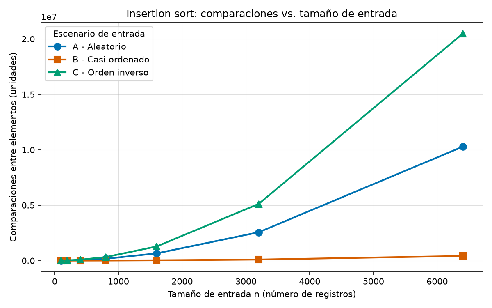
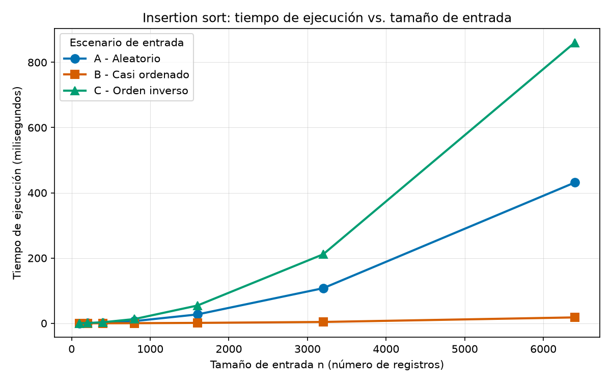
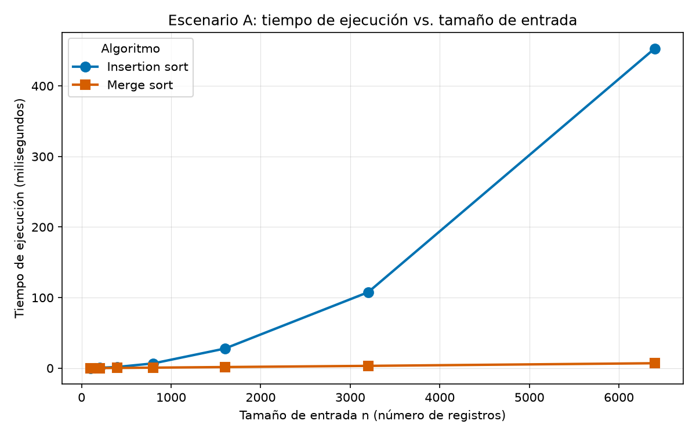

# Laboratorio evaluativo 01 — Fundamentos, complejidad y recurrencias

- **Nombre:** Juan Sebastián Echeverri Gallego
- **Curso:** Análisis de Algoritmos
- **Caso:** Plataforma Tamiza — Secretaría de Salud departamental

Todo el ordenamiento de este laboratorio se hace **de mayor a menor índice de
riesgo**, que es el orden en que Tamiza necesita la lista de llamadas. Los tres
generadores de escenarios, los dos algoritmos y el análisis de los casos usan
ese mismo criterio.

## Cómo reproducir el experimento

Desde la raíz del repositorio, con el entorno virtual activado:

```bash
python -m venv venv
source venv/bin/activate
pip install -r requirements.txt
```

En Windows el entorno se activa con `venv\Scripts\activate`.

Ya con el entorno activo, parado en la carpeta de este laboratorio:

```bash
cd lab1-fundamentos-complejidad-recurrencias
python parte3_casos.py         # tabla de la Parte 3 y sus dos gráficas
python parte4_complejidad.py   # tabla de la Parte 4 y su gráfica
```

Cada script imprime en consola las mismas cifras de las tablas de este informe
y escribe sus imágenes en `graficas/`. Los generadores reciben una semilla fija
(42), así que el conteo de comparaciones se repite exactamente en cualquier
máquina; los tiempos sí cambian unos milisegundos entre corridas.

**Condiciones de medición:** portátil con Windows 11, Python 3.14 y matplotlib
3.11.1. Cada punto de las gráficas es la **mediana de tres corridas**. El
cronómetro (`time.perf_counter()`) encierra únicamente la llamada al algoritmo:
el lote se construye antes de arrancarlo.

---

## Parte 1 — Analizar el algoritmo antes de comprar hardware

Un algoritmo es correcto cuando, para toda entrada válida, entrega la salida
que la especificación pide. En Tamiza eso significa que la lista que sale tiene
los mismos 1.200.000 registros que entraron y queda ordenada de mayor a menor
índice de riesgo, sin importar en qué orden hayan llegado. Insertion sort
cumple eso y lo viene cumpliendo hace ocho años: nunca se ha reportado una
lista mal ordenada ni pacientes perdidos.

Cosa distinta es el consumo de recursos. El proceso arranca a las 2:00 a. m. y
la lista tiene que estar armada a las 6:00 a. m., cuando el centro de contacto
empieza a llamar. Esas cuatro horas de CPU del servidor nocturno son la
restricción concreta que el sistema está incumpliendo, y es la que hizo que
tres veces en las últimas semanas se trabajara con una lista parcial. La
corrección se verifica mirando la salida; el cumplimiento de la ventana se
verifica cronometrando la ejecución. Por eso lo primero no implica lo segundo:
el algoritmo puede seguir dando la respuesta exacta y entregarla a las diez de
la mañana, cuando ya no le sirve a nadie.

Duplicar la velocidad del servidor no resuelve el problema de fondo porque
ataca la constante y no el crecimiento. Cuando se escribió la plataforma el
lote era de unos 20.000 registros. Hoy son 1.200.000: sesenta veces más datos.
Como insertion sort hace del orden de n²/2 comparaciones, multiplicar los datos
por 60 multiplica el trabajo por unas 3.600 veces. Una máquina del doble de
velocidad divide el tiempo entre dos: devuelve un factor 2 contra un factor
3.600 ya acumulado. Y el margen que compra se agota solo: si el lote pasa a
1.700.000 registros (un 40 % más), el trabajo sube cerca del doble y la ventana
se rompe otra vez, ya con el contrato firmado. Las mediciones de la Parte 3 le
ponen número a esto: extrapolando desde n = 6.400, el proceso actual con
1.200.000 registros se va a unas 4 horas 15 minutos con un lote aleatorio y a
más de 8 horas si llega invertido.

El semestre pasado me pasó algo parecido en un proyecto de bases de datos.
Crucé el archivo de facturas contra el de pagos para marcar los que quedaban
sin conciliar, con dos ciclos anidados. Con los 500 registros de prueba
respondía de inmediato. Con el archivo real del año, unas 45.000 facturas
contra 52.000 pagos, el reporte se demoraba más de seis minutos, y la
restricción era que la petición salía desde una pantalla web con un límite de
30 segundos: el servidor cortaba la conexión y el usuario nunca veía el
resultado. El código era correcto, lo verifiqué contra la conciliación hecha a
mano; lo que no cabía era en el límite de respuesta del navegador. No lo
arreglé cambiando de máquina sino indexando los pagos en un diccionario.

---

## Parte 2 — Responsabilidad ambiental y ética de la implementación

**Dimensión ambiental.** El tiempo de ejecución del proceso nocturno es tiempo
de CPU al 100 %, y esa CPU consume energía mientras trabaja. La cuenta se puede
hacer con mis propias mediciones. Extrapolando el escenario A a 1.200.000
registros, insertion sort necesita unas 4,25 horas de procesador; merge sort,
por la misma vía, queda en el orden de segundos. Si asumo que el servidor
consume 200 W mientras ordena, cada madrugada el ordenamiento se lleva
alrededor de 0,85 kWh contra los pocos vatios-hora del otro algoritmo. Visto de
a una noche no parece nada, pero el proceso corre todas las madrugadas: son
unos 310 kWh al año, y la plataforma lleva ocho años en producción. El gasto no
es un pico aislado sino una constante diaria, y además crece con el cuadrado
del tamaño del lote cada vez que el programa cubre más municipios. Comprar el
servidor del doble de velocidad empeora la cuenta por los dos lados: una
máquina más rápida consume más vatios por hora y el trabajo que hay que hacer
sigue siendo exactamente el mismo.

**Dimensión ética.** La primera forma concreta de daño es el paciente que se
queda por fuera de la lista. Cuando el proceso no alcanza a terminar y el
centro de contacto trabaja con una lista parcial y sin ordenar, un paciente con
índice de riesgo alto puede quedar en la cola detrás de pacientes de riesgo
bajo, o directamente no aparecer ese día. El costo del error lo asume él, con
un retraso en su valoración médica que puede no ser recuperable, y él no
participó en ninguna decisión. La responsabilidad es de quien decidió dejar el
algoritmo como estaba sabiendo que la ventana ya no se cumplía: el equipo de
desarrollo que lo mantiene y la Secretaría que aprueba el presupuesto.

La segunda es el operador del centro de contacto. Recibe una lista que no está
ordenada por riesgo y no tiene cómo saberlo: llama de arriba hacia abajo
confiando en que el orden significa algo. Si después se revisa por qué se llamó
tarde a un paciente grave, el registro muestra el nombre del operador al lado
de cada llamada, no el del proceso que no terminó a las 6:00 a. m. El costo se
le traslada a la persona con menos información y menos capacidad de decisión de
toda la cadena. Quien debería asumirlo es el equipo técnico, que sí sabe que la
lista puede venir incompleta y no lo está avisando en la herramienta.

Hay una tensión propia de este caso que va más allá del tiempo: el orden de la
lista decide a quién se llama primero. Eso convierte al criterio de
ordenamiento en una decisión clínica y no solo técnica. Si dos pacientes tienen
el mismo índice de riesgo, algo tiene que desempatar, y ese algo lo termina
definiendo la implementación, casi siempre sin que nadie lo haya discutido. La
obligación adicional que impone es que el ordenamiento sea estable y trazable:
que ante índices iguales el resultado sea siempre el mismo y siga un criterio
explícito (por ejemplo, la antigüedad del registro pendiente), y que quede
guardado con qué índice y en qué posición entró cada paciente. Un algoritmo que
ordena bien pero desempata de forma impredecible cumple la especificación y aun
así reparte la atención por azar.

---

## Parte 3 — Peor caso, mejor caso y caso promedio, demostrados en Python

Código de esta parte: [parte3_casos.py](parte3_casos.py). Los algoritmos
instrumentados están en [algoritmos.py](algoritmos.py) y los tres generadores
de escenarios en [datos.py](datos.py).

### 3.1 Explicación

Los tres casos no son tres entradas: son tres formas de resumir el costo del
algoritmo sobre **el conjunto de todas las entradas posibles de un mismo tamaño
n**. Se fija n, se consideran todas las listas de n índices de riesgo que se le
pueden dar al algoritmo, y sobre ese conjunto se toma:

- **Peor caso:** el **máximo** del costo. Es la entrada de tamaño n que más
  comparaciones le cuesta al algoritmo. Para insertion sort ordenando de mayor a
  menor, es la lista que viene de menor a mayor: cada elemento nuevo tiene que
  recorrer todo lo que ya está ordenado.
- **Mejor caso:** el **mínimo** del costo sobre ese mismo conjunto. Para
  insertion sort es la lista que ya viene de mayor a menor: cada elemento se
  compara una sola vez con su vecino de la izquierda y se queda donde está.
- **Caso promedio:** el **promedio** del costo sobre ese conjunto, y aquí hay
  que decir con qué probabilidad aparece cada entrada. Lo usual, y lo que asumo
  acá, es que todas las permutaciones de los n índices son igual de probables.
  Bajo ese supuesto, cada elemento recorre en promedio la mitad de la parte ya
  ordenada.

Decir "el caso malo" sin decir sobre qué conjunto se toma el máximo no dice
nada, porque el costo de un algoritmo no es un número sino una función del
tamaño y de la forma de la entrada.

**Cuál usaría para decidir si Tamiza entra en producción: el peor caso.** La
ventana de cuatro horas no es una meta promedio, es un límite que se cumple o
se incumple cada madrugada, y el equipo no controla cómo llega el lote: el
canal de origen puede cambiar sin aviso (una migración, un reproceso, un
laboratorio nuevo que sube los archivos de otra forma). Un compromiso basado en
el promedio dice que el proceso cabe "casi siempre", y ese "casi" es la noche
en que el centro de contacto llama con lista parcial. Si el peor caso cabe en
la ventana, cabe cualquier entrada.

**Predicción antes de medir.** Ordenando de mayor a menor, espero que el
**escenario C sea el peor caso**, porque llega exactamente al revés y cada
registro debe atravesar toda la lista ya ordenada: unas n(n−1)/2 comparaciones.
Espero que el **escenario B sea el mejor** de los tres, porque el 98 % ya está
en el orden final y solo el 2 % anexado al final tiene que viajar; aclaro que
no es el mejor caso teórico, que sería la lista completamente ordenada con n−1
comparaciones. Y espero que el **escenario A quede en la mitad y sea el que se
aproxima al caso promedio**, con cerca de n(n−1)/4 comparaciones, porque es una
permutación aleatoria y es justo la situación que modela el promedio.

### 3.2 Demostración experimental

Medición con insertion sort sobre los tres escenarios, siete tamaños de
entrada, mediana de tres corridas:

| n | A — comparaciones | A — tiempo (ms) | B — comparaciones | B — tiempo (ms) | C — comparaciones | C — tiempo (ms) |
|---:|---:|---:|---:|---:|---:|---:|
| 100 | 2.812 | 0,12 | 191 | 0,01 | 4.950 | 0,21 |
| 200 | 11.016 | 0,44 | 725 | 0,03 | 19.900 | 0,82 |
| 400 | 41.201 | 1,69 | 2.349 | 0,10 | 79.800 | 3,18 |
| 800 | 165.575 | 6,72 | 7.075 | 0,30 | 319.600 | 12,97 |
| 1.600 | 653.348 | 27,18 | 30.534 | 1,30 | 1.279.200 | 52,28 |
| 3.200 | 2.560.232 | 107,40 | 107.363 | 4,55 | 5.118.400 | 213,84 |
| 6.400 | 10.279.781 | 435,68 | 387.751 | 16,57 | 20.476.800 | 862,43 |





**Qué escenario resultó ser el peor caso.** El C, el de orden inverso. Es la
curva que queda por encima de todas en las dos gráficas y crece con la misma
forma que la del escenario A pero al doble de altura. En n = 6.400 hizo
20.476.800 comparaciones y se tomó 862,43 ms. Ese conteo coincide con el peor
caso teórico hasta la última cifra: n(n−1)/2 = 6.400 × 6.399 / 2 = 20.476.800.
No es una aproximación, es el número exacto, y eso confirma que el generador
está produciendo el peor caso real del algoritmo.

**Cuál resultó el mejor.** El B, el casi ordenado. En la gráfica de
comparaciones queda pegado al eje horizontal, tan abajo que casi no se
distingue: en n = 6.400 son 387.751 comparaciones contra 20.476.800 del C, unas
53 veces menos, y 16,57 ms contra 862,43 ms. Aun así no es el mejor caso
teórico, que serían 6.399 comparaciones; el 2 % de registros nuevos que se
anexan al final tiene que atravesar en promedio media lista, y eso da 0,02 × n
× (0,98n / 2) ≈ 401.000 comparaciones, muy cerca de lo que medí.

**Cuál se aproxima al caso promedio.** El A, el aleatorio. En n = 6.400 midió
10.279.781 comparaciones, y el valor esperado bajo el supuesto de permutaciones
equiprobables es n(n−1)/4 = 10.238.400. La diferencia es de 0,4 %, que es lo
que se puede esperar de una sola muestra aleatoria. En la gráfica, la curva de
A queda justo a la mitad entre C y el eje, que es lo que dice la teoría: la
mitad del trabajo del peor caso.

**Contraste con la predicción de 3.1.** El experimento no me contradijo. Los
tres escenarios quedaron en el orden que predije (C peor, B mejor, A en la
mitad) y los tres conteos cayeron sobre las fórmulas que había escrito. Lo
único que no había anticipado con precisión era qué tan abajo iba a quedar B:
esperaba una diferencia grande contra A, pero no que en la gráfica lineal
quedara prácticamente sobre el eje. También vale anotar que B sigue siendo
cuadrático, no lineal: al pasar de n = 3.200 a n = 6.400 sus comparaciones se
multiplicaron por 3,6, no por 2. El crecimiento sigue siendo cuadrático, solo
que con una constante unas 50 veces más pequeña.

---

## Parte 4 — Complejidad de merge sort e insertion sort: cálculo y validación

Código de esta parte: [parte4_complejidad.py](parte4_complejidad.py), con
`merge_sort` e `insertion_sort` definidos en [algoritmos.py](algoritmos.py).

### 4.1 Cálculo teórico

#### Planteamiento de la recurrencia de merge sort

```
T(n) = 2 T(n/2) + Θ(n)      para n > 1
T(1) = Θ(1)
```

De dónde sale cada término, siguiendo mi implementación:

- **2** es el número de subproblemas: cada llamada parte la lista en dos mitades
  y se llama recursivamente sobre cada una (`merge_sort(lista[:medio])` y
  `merge_sort(lista[medio:])`).
- **n/2** es el tamaño de cada subproblema: la lista se corta por la mitad, así
  que cada llamada recibe la mitad de los elementos de la que la invocó.
- **Θ(n)** es el costo de dividir y combinar fuera de las llamadas recursivas.
  Partir la lista en dos copias cuesta Θ(n), y la mezcla recorre los dos
  subarreglos con dos índices que solo avanzan, haciendo a lo sumo n−1
  comparaciones y n inserciones en el resultado, o sea Θ(n) también.
- **T(1) = Θ(1)** es el caso base: una lista de un elemento ya está ordenada y
  la función retorna sin comparar nada.

#### Solución por árbol de recursión

Escribo el término no recursivo como cn, con c constante.

```
Nivel 0:                        T(n)                          costo: cn

Nivel 1:               T(n/2)          T(n/2)                 costo: 2·c(n/2)   = cn

Nivel 2:          T(n/4)  T(n/4)   T(n/4)  T(n/4)             costo: 4·c(n/4)   = cn

   .                  .       .        .       .                        .
   .                  .       .        .       .                        .

Nivel k:          2^k subproblemas de tamaño n/2^k            costo: 2^k·c(n/2^k) = cn

   .                                                                    .
   .                                                                    .

Nivel log2(n):    n subproblemas de tamaño 1                  costo: n·c(1)    = Θ(n)
```

**Costo por nivel.** En el nivel k hay 2^k subproblemas y cada uno tiene tamaño
n/2^k, así que el costo del nivel es 2^k · c(n/2^k) = cn. El costo es el mismo
en todos los niveles: lo que se gana porque los subproblemas son más pequeños
se pierde porque son más.

**Número de niveles.** El tamaño en el nivel k es n/2^k. El árbol llega a las
hojas cuando n/2^k = 1, es decir cuando 2^k = n, o sea k = log₂ n. Contando
desde el nivel 0, el árbol tiene log₂ n + 1 niveles.

**Costo total.** Se suman los niveles:

```
T(n) = cn · (log2(n) + 1) = cn·log2(n) + cn
```

Como el término dominante es n log n, la cota final es:

```
T(n) = Θ(n log n)
```

**Verificación con el método maestro.** Con a = 2, b = 2 y f(n) = Θ(n), se
tiene n^(log_b a) = n^(log₂ 2) = n¹ = n. Como f(n) = Θ(n) = Θ(n^(log_b a)), se
cumple la condición del segundo caso, que concluye T(n) = Θ(n^(log_b a) · log
n) = Θ(n log n). Coincide con el resultado del árbol.

#### Cota de insertion sort, línea a línea

Este es el código de `insertion_sort` en [algoritmos.py](algoritmos.py). Llamo
n al número de elementos; para cada iteración i (de 1 a n−1) llamo d_i al
número de desplazamientos que hace esa iteración y c_i a las comparaciones
entre elementos que realiza, con c_i ≤ i.

| # | Línea | Costo | Veces que se ejecuta |
|---|---|---|---|
| 1 | `lista = list(datos)` | c₁ por elemento | n |
| 2 | `comparaciones = 0` | c₂ | 1 |
| 3 | `for i in range(1, len(lista)):` | c₃ | n |
| 4 | `clave = lista[i]` | c₄ | n − 1 |
| 5 | `j = i - 1` | c₅ | n − 1 |
| 6 | `while j >= 0:` | c₆ | Σ (d_i + 1) = Σ d_i + (n − 1) |
| 7 | `comparaciones += 1` | c₇ | Σ c_i |
| 8 | `if lista[j] < clave:` | c₈ | Σ c_i |
| 9 | `lista[j + 1] = lista[j]` | c₉ | Σ d_i |
| 10 | `j -= 1` | c₁₀ | Σ d_i |
| 11 | `break` | c₁₁ | a lo sumo n − 1 |
| 12 | `lista[j + 1] = clave` | c₁₂ | n − 1 |
| 13 | `return lista, comparaciones` | c₁₃ | 1 |

Las sumatorias van de i = 1 a n − 1. Sumando el costo de cada línea por sus
veces:

```
T(n) = c1·n + c2 + c3·n + (c4 + c5 + c12)(n-1) + c6·(Σd_i + n - 1)
       + (c7 + c8)·Σc_i + (c9 + c10)·Σd_i + c11·(n-1) + c13
```

Agrupando lo que no depende de la forma de la entrada, queda

```
T(n) = A·n + B + (c6 + c9 + c10)·Σd_i + (c7 + c8)·Σc_i
```

con A y B constantes. Todo el comportamiento está en las dos sumatorias:

- **Mejor caso** (lista ya de mayor a menor): ningún elemento se mueve, d_i = 0
  y c_i = 1 para toda iteración. Entonces Σd_i = 0 y Σc_i = n − 1, y queda
  T(n) = A·n + B + (c₇ + c₈)(n − 1), un polinomio de grado 1: **Θ(n)**. Son
  exactamente n − 1 comparaciones; lo comprobé pasándole a `insertion_sort` una
  lista de 100 elementos ya ordenada de mayor a menor, que devolvió 99.
- **Peor caso** (lista de menor a mayor): cada clave atraviesa todo lo ordenado,
  d_i = c_i = i. Entonces Σd_i = Σc_i = n(n−1)/2, y el término dominante es
  n²/2 multiplicado por una constante: **Θ(n²)**.
- **Caso promedio** (permutaciones equiprobables): cada clave recorre en
  promedio la mitad de la parte ordenada, d_i ≈ i/2, así que las sumatorias
  valen cerca de n(n−1)/4. Sigue siendo un polinomio de grado 2: **Θ(n²)**, con
  la mitad de la constante del peor caso.

#### Tabla de complejidades esperadas

| Algoritmo | Mejor caso | Peor caso | Caso promedio |
|---|---|---|---|
| Insertion sort | Θ(n) | Θ(n²) | Θ(n²) |
| Merge sort | Θ(n log n) | Θ(n log n) | Θ(n log n) |

Merge sort tiene la misma cota en las tres columnas porque parte la lista por
la mitad sin mirar los valores: el árbol de recursión tiene la misma altura y
el mismo costo por nivel para cualquier entrada. Insertion sort, en cambio,
decide cuánto trabaja según lo que encuentra, y por eso su costo se mueve entre
n y n².

### 4.2 Validación experimental

Los dos algoritmos sobre el escenario A (aleatorio), con los mismos tamaños de
la Parte 3 y mediana de tres corridas:

| n | Insertion — comparaciones | Insertion — tiempo (ms) | Merge — comparaciones | Merge — tiempo (ms) |
|---:|---:|---:|---:|---:|
| 100 | 2.812 | 0,12 | 545 | 0,08 |
| 200 | 11.016 | 0,45 | 1.290 | 0,16 |
| 400 | 41.201 | 1,71 | 2.939 | 0,35 |
| 800 | 165.575 | 6,76 | 6.721 | 0,76 |
| 1.600 | 653.348 | 27,30 | 15.084 | 1,62 |
| 3.200 | 2.560.232 | 107,02 | 33.285 | 3,26 |
| 6.400 | 10.279.781 | 436,54 | 72.914 | 7,07 |



**Cuál de los dos algoritmos es mejor para Tamiza, leído en la gráfica.** Merge
sort. Su curva es la que se ve casi plana sobre el eje horizontal, mientras que
la de insertion sort se despega desde n = 1.600 y se dispara. En el extremo
derecho de la gráfica, con n = 6.400, insertion sort marca 436,54 ms y merge
sort 7,07 ms: 62 veces más rápido en el mismo punto.

Lo que hace cada curva a medida que crece n se ve mejor en los saltos. Cuando
el tamaño se duplica, el tiempo de insertion sort se multiplica por 4 (107,02
ms → 436,54 ms es 4,08 veces) y el de merge sort apenas por poco más de 2 (3,26
ms → 7,07 ms es 2,17 veces). Esa es la diferencia entre las dos curvas: una
crece con el cuadrado del tamaño y la otra casi proporcional al tamaño.

**Coincide con lo calculado en 4.1.** El factor 4 al duplicar n es la firma de
Θ(n²): si T(n) ≈ kn², entonces T(2n) = 4kn². El factor 2,17 de merge sort es la
firma de Θ(n log n): al duplicar n el tiempo se multiplica por 2 más el pequeño
aporte del logaritmo, que en este rango predice 2 × (log₂ 6.400 / log₂ 3.200) =
2,16, prácticamente el 2,17 medido. Los conteos de comparaciones dicen lo mismo
sin depender de la máquina: 10.279.781 contra 72.914 en n = 6.400.

**Lo que pasa en los tamaños pequeños.** En el extremo izquierdo de la gráfica
las dos curvas están pegadas y la ventaja de merge sort casi no existe: en n =
100 son 0,12 ms contra 0,08 ms. Ahí las constantes pesan más que el orden de
crecimiento, porque merge sort paga por crear listas nuevas en cada nivel y por
las llamadas recursivas, mientras insertion sort trabaja sobre un solo arreglo.
Midiendo por debajo de n = 100 se ve el cruce: hasta unos 50 elementos
insertion sort es más rápido, y alrededor de n = 60 las dos curvas se cortan.
Es el comportamiento esperado, no un error de implementación: la ventaja
asintótica solo se nota cuando n es grande, y para el tamaño que le interesa a
Tamiza (1.200.000) estamos muchísimo más allá de ese cruce.

### 4.3 Concepto técnico a la Secretaría de Salud

- **Para:** equipo de ingeniería de la Secretaría de Salud
- **Asunto:** algoritmo del proceso nocturno de Tamiza

**Recomendación: reemplazar insertion sort por merge sort como única
implementación del proceso nocturno.** El criterio con el que resolví el
compromiso es elegir el algoritmo por su peor caso y no por el escenario más
frecuente hoy, porque el canal de entrada puede cambiar sin aviso y ustedes no
quieren mantener tres implementaciones. Merge sort cuesta lo mismo, del orden
de n log n, para las tres formas de llegada del lote: parte la lista por la
mitad sin mirar los valores, así que una migración, un reproceso o un cargue
directo le cuestan igual. Insertion sort no da esa garantía: en mis mediciones,
el mismo algoritmo con el mismo tamaño de entrada tarda 16,57 ms con el lote
casi ordenado y 862,43 ms con el lote invertido (n = 6.400). Son 52 veces de
diferencia decididas por el canal de origen, que es lo que no se controla.

**Estimación para la ventana de cuatro horas.** Aclaro que lo que sigue es una
estimación, no una medición: el tamaño más grande que medí fue n = 6.400 y de
ahí extrapolo usando la forma de cada curva. De 6.400 a 1.200.000 el tamaño se
multiplica por 187,5. Insertion sort crece con el cuadrado, así que su tiempo
se multiplica por 187,5² ≈ 35.150: los 435,68 ms del escenario aleatorio se
convierten en unas **4 horas 15 minutos**, y los 862,43 ms del lote invertido
en unas **8 horas 25 minutos**. Las dos están por fuera de la ventana,
consistente con las tres noches en que la lista quedó incompleta. Merge sort
crece con n log n, así que su factor es (1.200.000 × log₂ 1.200.000) / (6.400 ×
log₂ 6.400) ≈ 300, y los 7,07 ms se convierten en unos **2 segundos**. Una
prueba suelta con n = 200.000 (844 ms) extrapola más bien a 6 segundos; aun así
el proceso queda tres órdenes de magnitud por debajo del límite.

**Sobre la compra del servidor del doble de velocidad.** Un servidor del doble
de velocidad de reloj divide el tiempo entre dos, en el mejor de los casos. La
brecha que hay que cerrar es de 62 veces: es el dato que tomé en n = 6.400
sobre el escenario aleatorio, donde insertion sort tarda 436,54 ms y merge sort
7,07 ms (gráfica `parte4_tiempo.png`). Con la máquina nueva, el proceso actual
pasaría de unas 4 horas 15 minutos a unas 2 horas 8 minutos en el escenario
típico: entra en la ventana por ahora, pero no en el escenario de orden inverso
(más de 4 horas), y vuelve a salirse en cuanto el lote crezca un 40 %, porque
el trabajo sube con el cuadrado y el hardware solo aporta un factor fijo. El
cambio de algoritmo no cuesta hardware y deja margen para años de crecimiento.

**Una consideración distinta del tiempo.** Merge sort usa memoria adicional
porque construye listas nuevas al mezclar. Lo medí con `tracemalloc`: para n =
100.000 el pico extra fue de 3,1 MB, que extrapolado a 1.200.000 registros da
unos 37 MB sobre la lista original. Para un servidor de este tipo es
despreciable frente a las horas de CPU que ahorra, pero conviene dejarlo
escrito antes de dimensionar la máquina. La mezcla implementada además es
estable: dos pacientes con el mismo índice de riesgo conservan el orden en que
venían, lo que permite fijar un desempate explícito y auditable.
