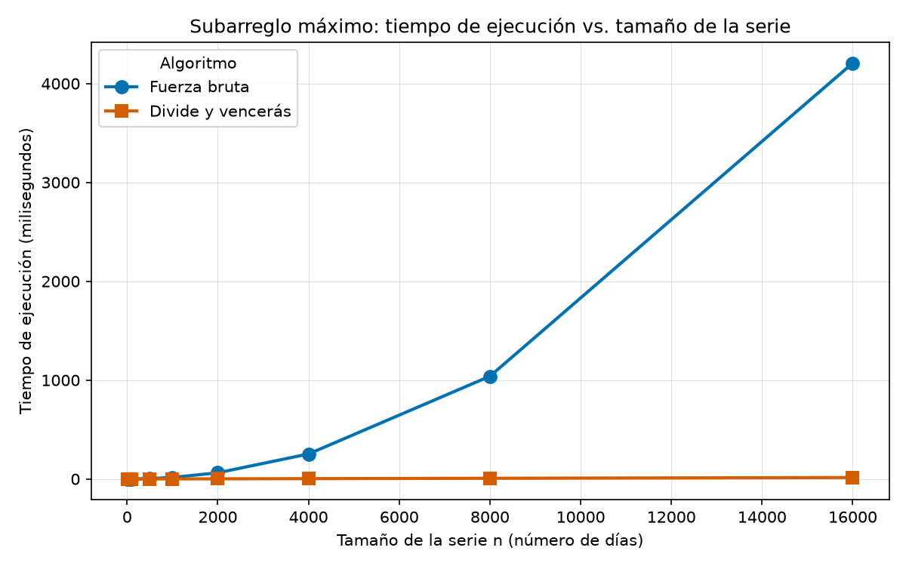

# Laboratorio evaluativo 02 — Dividir y vencer

- **Nombre:** Juan Sebastián Echeverri Gallego
- **Curso:** Análisis de Algoritmos
- **Caso:** Cooperativa de tiendas de barrio — mejor racha de variación de caja

## Cómo reproducir el experimento

Desde la raíz del repositorio, con el entorno virtual activado:

```bash
python -m venv venv
source venv/bin/activate
pip install -r requirements.txt
```

En Windows el entorno se activa con `venv\Scripts\activate`.

Ya con el entorno activo, parado en la carpeta de este laboratorio:

```bash
cd lab2-divide-y-vencer
python pruebas.py     # verifica las dos soluciones; no imprime nada si todo pasa
python medicion.py    # imprime la tabla de tiempos y genera la gráfica
```

`pruebas.py` termina con un mensaje si todos los `assert` pasan y se cae en el
primero que falle. `medicion.py` escribe su imagen en `graficas/`.

**Condiciones de medición:** portátil con Windows 11, Python 3.14 y matplotlib
3.11.1.

---

## Parte 1 — Implementar y verificar las dos soluciones

Código: [subarreglo.py](subarreglo.py). Pruebas: [pruebas.py](pruebas.py).

`subarreglo_fuerza_bruta` recorre todos los pares de días (i, j) acumulando la
suma dentro del ciclo interno, así que cada par cuesta una suma y una
comparación. `subarreglo_maximo` resuelve los tres casos: la mejor racha de la
mitad izquierda, la de la derecha y la que cruza el punto medio, que calcula
`suma_cruzada` con dos barridos lineales desde el centro hacia cada lado.
Devuelve el mejor de los tres comparándolos uno a uno, sin llamar a la fuerza
bruta.

La verificación compara **la suma**, no los índices, porque cuando hay varios
tramos empatados cualquiera es válido. Cada caso revisa además que los índices
devueltos realmente sumen lo que el algoritmo dice, y que ninguna de las dos
funciones modifique la lista recibida.

Casos cubiertos:

- La serie de ocho días de la situación problema, que debe dar 17.
- Series de un solo elemento, positivo y negativo.
- Series con todos los valores negativos, donde la respuesta es el día menos
  malo y no la serie completa.
- Series con todos los valores positivos, donde la respuesta es la serie entera.
- Dos casos donde la mejor racha cruza el punto medio y ninguna mitad por
  separado la contiene: `[-2, 6, -1, 7, -3]` (la izquierda da 6, la derecha 7 y
  el tramo cruzado 12) y `[4, -10, 3, 3, -10, 4]`.
- Veinte listas aleatorias de largo y contenido variable, con semilla fija, en
  las que ambas soluciones deben coincidir en la suma.
- Diez listas aleatorias más de un solo signo, que son las que suelen romper el
  caso base.

---

## Parte 2 — Medir y graficar

Código: [medicion.py](medicion.py).



**Cómo medí.** Nueve tamaños de serie, de 10 a 16.000 días, con valores enteros
entre −100 y 100 generados con semilla fija (42). En cada tamaño los dos
algoritmos reciben **la misma lista**, y el propio script comprueba con un
`assert` que las dos soluciones devuelven la misma suma antes de registrar el
tiempo. Cada medición es la **mediana de cinco corridas**, para que un pico del
sistema operativo no mueva el punto. El cronómetro (`time.perf_counter()`)
encierra únicamente la llamada al algoritmo: la serie se genera antes de
arrancarlo.

En escala lineal la curva de divide y vencerás queda pegada al eje horizontal,
así que agrego la tabla de valores medidos para poder leer los tamaños
pequeños:

| n (días) | Fuerza bruta (ms) | Divide y vencerás (ms) |
|---:|---:|---:|
| 10 | 0,0027 | 0,0048 |
| 50 | 0,0408 | 0,0292 |
| 100 | 0,1547 | 0,0618 |
| 500 | 4,0163 | 0,3594 |
| 1.000 | 15,7666 | 0,7654 |
| 2.000 | 64,8041 | 1,6035 |
| 4.000 | 264,8269 | 3,3686 |
| 8.000 | 1.057,0678 | 7,0417 |
| 16.000 | 4.232,6862 | 14,7222 |

---

## Parte 3 — Análisis

### 1. Recurrencia

`subarreglo_maximo` parte el rango en dos mitades y se llama sobre cada una: de
ahí los **dos** subproblemas de tamaño **n/2**. Fuera de la recursión queda el
caso cruzado, dos barridos lineales desde el punto medio que entre ambos tocan
cada elemento una vez, o sea **Θ(n)**; comparar los tres resultados cuesta Θ(1).
Con T(1) = Θ(1) como caso base, la recurrencia es `T(n) = 2T(n/2) + Θ(n)`.

Por el método maestro, a = 2, b = 2 y f(n) = Θ(n), de modo que
n^(log_b a) = n^(log₂ 2) = n. El segundo caso pide que f(n) crezca igual que
n^(log_b a), y aquí f(n) = Θ(n) = Θ(n^(log_b a)): se cumple. Concluye
T(n) = Θ(n^(log_b a) · log n) = **Θ(n log n)**.

La fuerza bruta es Θ(n²) porque evalúa los n(n+1)/2 pares de días y, como la
suma se acumula dentro del ciclo en vez de recalcularse, cada par cuesta una
suma y una comparación.

### 2. Lo medido contra lo esperado

En la gráfica la fuerza bruta se mantiene casi pegada al eje hasta n = 2.000 y
desde ahí se dispara con curvatura creciente; divide y vencerás no se despega
del eje en toda la escala. Tomando los dos últimos tamaños, que son
consecutivos y duplican n: la fuerza bruta pasa de 1.057,07 ms a 4.232,69 ms, se
multiplicó por **4,00**; divide y vencerás pasa de 7,04 ms a 14,72 ms, se
multiplicó por **2,09**. Θ(n²) predice exactamente ×4 al duplicar n, y
Θ(n log n) predice 2 × (log₂ 16.000 / log₂ 8.000) = 2,15. Lo medido coincide
con lo esperado en los dos casos.

### 3. Tamaños pequeños

Sí hay un tamaño desde el cual divide y vencerás empieza a ganar, y está
**entre 30 y 40 días**. Midiendo en ese rango, con n = 30 la fuerza bruta
todavía gana (15,2 µs contra 16,2 µs) y con n = 40 ya pierde (25,7 µs contra
22,7 µs).
En la tabla se ve el mismo cruce entre las dos primeras filas: con n = 10 la
fuerza bruta es casi el doble de rápida y con n = 50 ya es 1,4 veces más lenta.
El motivo es que divide y vencerás paga llamadas recursivas y creación de tuplas
en cada nivel, mientras la fuerza bruta son dos ciclos sin nada alrededor. Esas
constantes pesan más que la ventaja asintótica mientras n sea chico.

### 4. ¿Cuándo conviene dividir?

Para hallar el máximo de n números, dividir no mejora nada. La recurrencia sería
`T(n) = 2T(n/2) + Θ(1)`, porque combinar es una sola comparación entre los dos
máximos parciales. Por el método maestro, con a = 2, b = 2 y f(n) = Θ(1), se
tiene n^(log_b a) = n y f(n) = O(n^(1−ε)): aplica el primer caso y
T(n) = Θ(n), lo mismo que recorrer el arreglo una vez, pero con el costo extra
de la recursión. Dividir aporta cuando combinar cuesta menos que lo que se
ahorra al no resolver el problema completo: en el subarreglo máximo se pasa de
Θ(n²) a Θ(n log n) porque combinar cuesta solo Θ(n). En el máximo no hay nada
que ahorrar: ya hay que mirar los n números una vez y ese es el piso.

### 5. Concepto para la gerente

Recomiendo divide y vencerás. Con las series actuales de 2.000 días la
diferencia es de milisegundos, pero para las series de sensores el algoritmo de
fuerza bruta no sirve. **Lo que sigue es una estimación, no una medición:**
extrapolo desde n = 16.000, que es el tamaño más grande que medí, usando la
forma de cada curva y no una regla de tres, porque la relación no es lineal. De
16.000 a 1.000.000 el tamaño se multiplica por 62,5. La fuerza bruta crece con
el cuadrado, así que su tiempo se multiplica por 62,5² ≈ 3.900: los 4.232,69 ms
se vuelven unas **4 horas 35 minutos**. Divide y vencerás crece con n log n, así
que su factor es (1.000.000 × log₂ 1.000.000) / (16.000 × log₂ 16.000) ≈ 89: los
14,72 ms se vuelven **1,3 segundos**.
